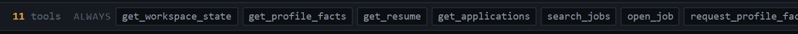
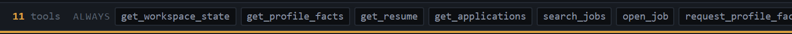
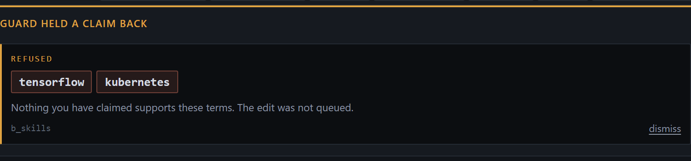
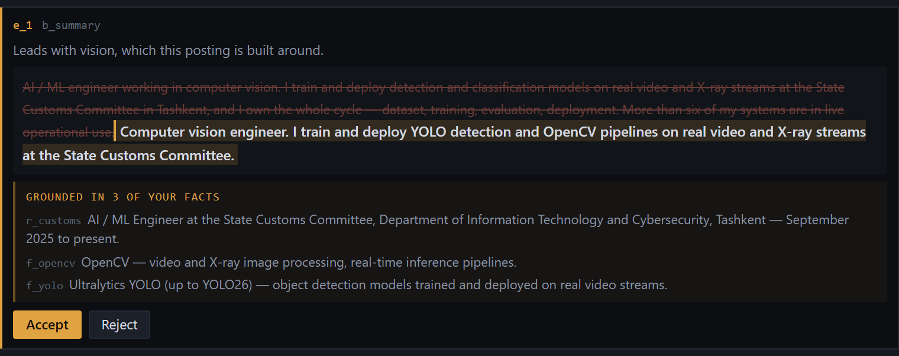

# Tailor

**An agent that can rewrite your resume, but not rewrite your experience.**

WebMCP turns the resume into an evidence-bound workspace: the agent proposes,
the page constrains, the human approves.

### ▸ [webmcp-openaihac-production.up.railway.app](https://webmcp-openaihac-production.up.railway.app/)

Open it in ChatGPT's built-in browser and the status strip reads **WebMCP
active**; the tools register against the live origin. In an ordinary browser it
is fully usable by hand and says **WebMCP not detected** rather than implying a
tool surface that is not there.

No sign-in, no backend, no empty state — the profile, resume and 120 postings
ship in the bundle. [`?reset=1`](https://webmcp-openaihac-production.up.railway.app/?reset=1)
restores the demo to how you first found it.

---

## If you only have five minutes

**Three files carry the argument:**

| File | What it shows |
|---|---|
| [`src/tools.ts`](src/tools.ts) | 13 tools and their scopes. The registered set changes with what is actually possible — see the lifecycle section below. |
| [`src/lib/guard.ts`](src/lib/guard.ts) | The grounding check. Its header states what it does **not** do, in full. |
| [`scripts/guard-tests.mjs`](scripts/guard-tests.mjs) | 30 adversarial cases trying to sneak false claims past it, including one that succeeds. |

**One interaction proves it.** Open a posting, ask the agent to add Kubernetes
to your skills, and watch `propose_resume_edits` come back refused with the
offending token named — while the same call queues a line about OpenCV, because
a fact you wrote supports that one. Then watch `prepare_application` disappear
from the agent's tool list until you have reviewed the diff.

Everything below is the detail behind those two sentences. The screenshots are
real, captured at the width the demo is recorded at.

---

## What this is

A job board over 120 real ML postings, where the resume is an editable object
and an AI agent is a first-class user of the page — working alongside the human
rather than instead of them.

The agent can search postings, read the user's fact bank, and propose resume
rewrites. It cannot apply them, and it cannot write a line whose claims do not
trace back to something the user recorded.

---

## The design claim: approval changes capability, not permission

This is the part worth taking from the project.

**`prepare_application` is not disabled while edits await review — it is not
registered. The capability does not exist.**

Most human-in-the-loop designs are a permission check: the tool is there, the
agent calls it, the app says no. That leaves the agent free to plan around a
capability it does not have, and to argue with the refusal. WebMCP lets the page
change the tool surface itself, so the constraint is expressed as *absence*.

The registered set mirrors what is possible right now:

```
7  at rest        get_workspace_state · get_profile_facts · get_resume · get_applications
                  search_jobs · open_job · request_profile_fact

11 job open       + get_job_details · get_fit_gaps · propose_resume_edits · prepare_application

11 edits pending  + withdraw_edit,  − prepare_application   ← same count, different surface

12 ready to send  + submit_application
```




*Before and after a proposal. `withdraw_edit` arrives as `prepare_application`
leaves, struck through. The count is identical; the surface is not — which is
why the app shows names rather than a number.*

Each scope is one `AbortController`; closing a job aborts it and unregisters
that scope in a single operation. The store-level refusal still exists for a
stale reference held from an earlier turn, but it is the second line of defence.
The first is that there is nothing to call.

Every scope change is also self-describing, because an agent that finds a tool
missing has nothing to read:

> `1 of 1 edit queued for review. Now available: withdraw_edit. No longer
> available: prepare_application (needs a job open and no edits pending review).`

---

## What the constraint looks like

Both captured at 760px, the width the demo is recorded at.

### A claim held back



The agent proposed *"Backend: FastAPI, Flask, Docker, Linux, Git. Familiar with
Kubernetes and TensorFlow."* citing `f_backend`. Two terms in that sentence trace
to nothing the user recorded, so the edit was not queued. Hedging does not help —
*"familiar with"* still contains the token.

### A claim that passes, and what it rests on



The same call queued this one. The panel underneath is the point: the claim rests
on three facts **in the user's own words**, quoted rather than referenced by id.
The strikethrough is context; the accent-barred insertion is the proposal.

---

## The grounding constraint

Every resume edit and the cover note pass through the same check. A line is
queued only if **every technology term, product name, number, superlative and
seniority claim in it is grounded** — present in a cited fact, or already in the
block being rewritten.

Refusals name the offending tokens, so the agent can correct itself rather than
retry blindly.

```jsonc
// refused — f_backend says nothing about either
{
  "reason": "unsupported_claim",
  "offendingTokens": ["tensorflow", "kubernetes"],
  "hint": "Nothing in the cited facts or the original block supports: tensorflow, kubernetes.
           Either cite a fact that does, call request_profile_fact to ask the user, or drop the claim."
}
```

```jsonc
// queued — every technology resolves to a cited fact, both numbers appear verbatim
{
  "targetBlockId": "b_exp_wagon",
  "newText": "Three-stage computer vision pipeline for railway wagons: detection mAP@50 0.994
              and ResNet18 recognition at 99.76% validation accuracy.",
  "sourceFactIds": ["a_wagon_pipeline", "a_wagon_metrics"]
}
```

Round `0.994` to `0.99+` and it is refused: rounding a metric invents a different
metric. `"near-perfect accuracy"` is refused as a superlative standing in for a
number. `"Led the team"` is refused as a seniority claim no fact supports and no
numeric check would catch.

`npm run guard-tests` runs 30 adversarial cases. 29 behave as expected, and
**zero true claims are refused** — which matters as much as the refusals, because
a guard that blocks honest work is a guard people switch off.

### What grounding is not

**Grounding is not truth.** The page checks that a claim traces to the user's own
record. It cannot know whether that record is accurate. If the fact bank is wrong,
the resume will be wrong, and the guard will pass it.

**Grounding is not entailment.** This one has a worked example, and it fails:

```
"Built an OCR pipeline that reads structured fields directly from X-ray scans."
  cites a_ocr_declaration (OCR on scanned documents) + a_xray_loaded (X-ray classifier)
```

Every ingredient is attested. The sentence asserts a combination neither fact
supports — those two projects never met. **The guard passes it.** No amount of
token matching will catch that; it needs entailment checking, which this is not.

Rather than pretend otherwise, the app marks any edit citing more than one
distinct project and puts the decision where it belongs:

> **Needs your judgement.** This sentence draws on 2 separate pieces of work. Each
> term is backed by a fact above, but nothing checks that the combination describes
> something that actually happened.

The failing case is kept in the test suite as an expected failure. It is
**surfaced, not solved.**

---

## Leading questions: three layers, each because the last one failed

The agent can ask the user to add a fact. It cannot write one — proven, not
assumed: `npm run misuse-tests` fires all 13 tools with arguments designed to
write a fact and asserts the bank is byte-identical afterwards.

But *asking* has its own failure mode, and finding it took three attempts. Each
layer exists because a real ChatGPT session showed the previous one was not
enough.

**Layer 1 — the description.** It originally read *"Ask the human to add a fact…
use it when get_fit_gaps reports something missing that you believe the candidate
actually has."*

> A live session: the agent replied **"Once you confirm, I'll add your TensorFlow
> and Kubernetes experience to the local profile fact bank."**

It believed it could write. The description had taught it that. Rewritten to open
with **DOES NOT ADD ANYTHING** and to say plainly that a missing requirement is
evidence the user does *not* have it.

**Layer 2 — the description was not enough.**

> Next session: the agent correctly said *"the app prevents me from inserting them
> until they're confirmed in your profile"* — then opened profile questions for
> TensorFlow and Kubernetes anyway, purely because `get_fit_gaps` listed them
> missing.

It read the instruction and did it anyway. So the tool now detects when a claim
names something **the open posting requires and the fact bank does not support**,
and returns a warning that leads the summary.

**Layer 3 — the agent might not relay it.** Layer 2 depends on the agent's
cooperation, and layer 1 already proved that is not reliable. The same warning
appears on screen, where it does not depend on the agent at all:

> **This question came from the job posting, not from your profile.** Nothing you
> have recorded mentions kubernetes, and this posting requires it. Add it only if
> you have genuinely done this work. A posting asking for something is not a
> reason to claim it.

The confirm button reads **"Yes, I have done this"**, not "Add to fact bank".

It warns rather than refuses, deliberately: the app cannot hear the conversation,
so it cannot tell *the agent inferred this from a gap* from *the user just said
they know Kubernetes*. Refusing would block the honest case to stop the dishonest
one.

---

## No server-side model call

There is no backend, no API key and no LLM call in this codebase. The page exposes
**capability, not cognition**.

That is the WebMCP-native choice rather than a shortcut. The intelligence is
already in the room — it is the agent the user brought. A page that also called a
model would be second-guessing it, and would need a key, a backend and a per-user
cost.

It also puts the trust boundary in the right place. The page's job is not to be
smart; it is to be **checkable**. `get_fit_gaps` is a deterministic set
comparison. The guard is string matching over a controlled vocabulary. Neither
involves a model, which is exactly why the agent's claims can be checked rather
than believed.

---

## The alias layer, and a false negative that matters

Postings and resumes describe the same skill with different words. The corpus
writes **TTS**, **STT** and **ASR**. This profile writes *"text to speech"* and
*"speech recognition"* — forms appearing in **zero** of the 175 fetched postings.

A literal comparison told a candidate with shipped speech systems that he lacked
speech experience. That is the classic ATS failure, and **a false negative is as
damaging as a false positive**: it tells someone to acquire a skill they already
have, and suppresses the fact that would have supported a legitimate line.

Job tags and fact tokens now resolve through one table — 65 concepts, 207 surface
forms. Aliases are **derived from the corpus by measurement**, and three obvious
ones were measured and rejected:

| Candidate alias | Measurement | Verdict |
|---|---|---|
| `cv` → computer vision | 10 hits, ~half *"apply with your CV"* | rejected |
| `serving` → model deployment | 37 hits, mostly *"serving 50,000+ customers"* | rejected |
| `classification` → image classification | 16 hits, ~80% *text* classification | profile-only |

`ray` is hyphen-guarded: the word-boundary matcher treats `-` as a separator, so
**"X-ray" would otherwise match the Ray framework** — and this profile is full of
X-ray inspection work.

---

## Job data

120 real postings, 115 remote, 1,099 evidence-carrying tags (541 required, 141
nice-to-have, 417 unclassified). Fetched at build time from four free, no-key
public APIs using Node's built-in `fetch` and no dependencies:

**[Jobicy](https://jobicy.com/) · [Himalayas](https://himalayas.app/) ·
[Arbeitnow](https://www.arbeitnow.com/) · [Remotive](https://remotive.com/)**

Every row keeps a `source` field and a canonical `url`. Descriptions are truncated
to 1,400 characters — the full text stays on the original site. We link out, we do
not republish.

```bash
npm run fetch-jobs     # rewrites src/data/jobs.json and src/data/vocabulary.json
```

Each tag carries a ~140-character **evidence** quote from the *full* posting,
because the stored description is truncated. Without it the app could say "this
job requires Kubernetes" while the requirement sat in text the user cannot see —
an unverifiable claim, which is the thing this product exists to constrain. The
page must not commit the error it refuses on the agent's behalf.

`required` is best-effort and **`null` when undetermined**, never guessed.
Unclassified tags are a third list rather than folded into "required", because
promoting them would manufacture a requirement the posting never stated.

---

## Running it

```bash
npm install
npm run dev              # http://localhost:5173
npm run build
```

The app is fully usable by hand in a browser with no WebMCP support —
`document.modelContext` is feature-detected and the strip says "WebMCP not
detected" rather than implying a tool surface that is not there.

```bash
npm run guard-tests      # 30 adversarial guard cases   (needs npm run dev)
npm run misuse-tests     # 41 agent-misuse cases        (needs a built preview)
```

`?reset=1` restores the shipped demo data and strips itself from the URL, so a
shared machine always starts clean.

### Testing it in ChatGPT's built-in browser

The strip should read **WebMCP active**.

1. *"What can you do on this page?"* → `get_workspace_state`, 7 tools.
2. *"Find remote computer-vision roles that don't want 5+ years"* → the sidebar
   filters visibly move.
3. *"Open the US LBM one"* → the rail goes 7 → 11.
4. *"How well do I fit?"* → 19 of 29 requirements evidenced, 2 years short of 3,
   with the fact the years figure came from.
5. *"Tailor my resume for it"* → diffs appear with their provenance panels.
6. **"Say I know Kubernetes"** → refused, token named. If the agent offers to ask
   you instead, the on-screen notice should tell you the question came from the
   posting and not from your profile.
7. Accept the rest → `prepare_application` re-registers → *"Send it"* →
   confirmation modal.

Nothing is sent without a human click, and aborting the turn closes the modal.

---

## Known limitations

**Compositional claims get through.** Every ingredient attested, the combination
invented. Flagged for the human, not blocked. Fixing it needs entailment checking.

**The leading-question flag only fires while a job is open.** It compares the
claim against the open posting's requirements, so with no job open nothing is
flagged. Widening it to "any tag the profile lacks" would flag legitimate
bank-completion questions too.

**140 KB brotli in one bundle, not split.** The job snapshot is 74 KB of that.
Splitting it behind a dynamic import was measured and rejected: the job list *is*
the first paint, so the bytes are on the critical path either way, and on a
bandwidth-limited link parallelism saves nothing. The gain was ~40 ms of parse
time; the cost was gating tool registration on an async load, with a failure mode
where a dropped fetch leaves tools registered against no data.

**`sourceSpread` groups projects by fact-id stem** (`a_wagon_*` → one project). A
naming convention doing semantic work. Fine for 32 facts; it would not survive a
bank ten times the size.

**Descriptions cannot be unit-tested.** The misuse suite calls tools directly, so
it can prove the fact bank is unwritable but not that an agent will not *claim* it
wrote to it. That gap is only closable by running real sessions — which is how all
three leading-question layers were found.

---

## Layout

```
docs/TOOL_CONTRACT.md     the spec; code follows it, and it wins when they disagree
docs/ABSENT_TERMS.md      what the fact bank deliberately does not contain, and why
docs/img/                 the screenshots above
scripts/fetch-jobs.mjs    build-time fetcher, no dependencies
scripts/guard-tests.mjs   adversarial guard suite
scripts/agent-misuse-tests.mjs   agent-shaped misuse suite
src/lib/guard.ts          the grounding check
src/lib/match.ts          alias resolution, filtering, fit gaps
src/store.ts              one store; UI actions and tool executes call the same functions
src/tools.ts              WebMCP registration and scope lifecycle
```

If a tool can do something no button can, that is a bug — which is why there is
exactly one implementation of each action.

## License

MIT — see [LICENSE](LICENSE).
